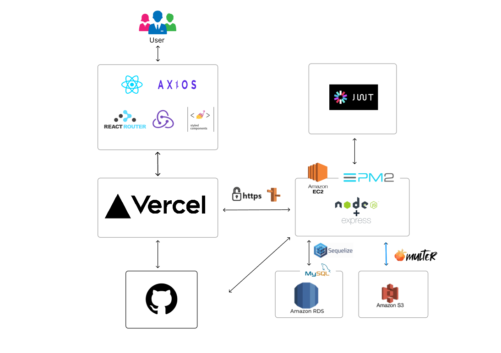
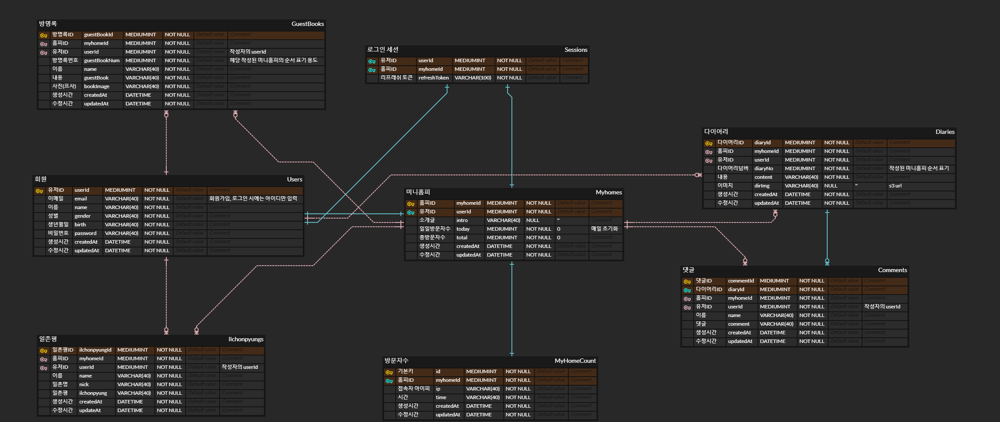

---------------------------

# ✨Cyworld-Refactoring (추억의 싸이월드)

- **그 때 우리가 느꼈던 그 시절 감성.**

# 📆 프로젝트 기간

- 2023/02/20 ~ 진행중

# 👒 팀 소개
| 역할 | 이름 | git |
| ------ | -- | ----|
| Back-end | 장용호 | https://github.com/JangKroed|
| Front-end | 정도은 | https://github.com/do-eun|

# 👔 Project Architecture

# 🩳 API 명세서
[▶ 추억의 드싸이월드 REST API 바로가기](https://www.notion.so/)

# 🧦 DB 설계도(ERD)

